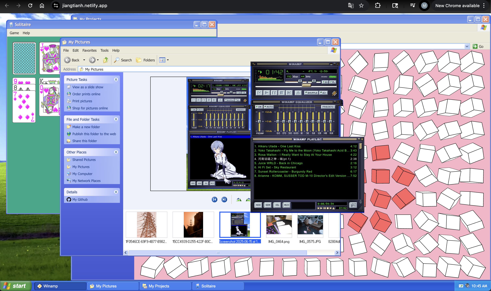

# 🖥️ WindowsXP Personal Site

Welcome to my nostalgic personal website – a fully interactive, browser-based recreation of a **Windows XP** desktop environment. This project is both a playful homage to early 2000s computing and a fully functional portfolio showcasing my projects, experience, and creativity.

Deployed on **Netlify**, powered by **React**, **Vite**, and **Tailwind CSS**, and packed with mini-games and retro tools, this site is completely front-end and self-contained.

[👉 Visit the Live Site](https://jiangtianh.netlify.app/)